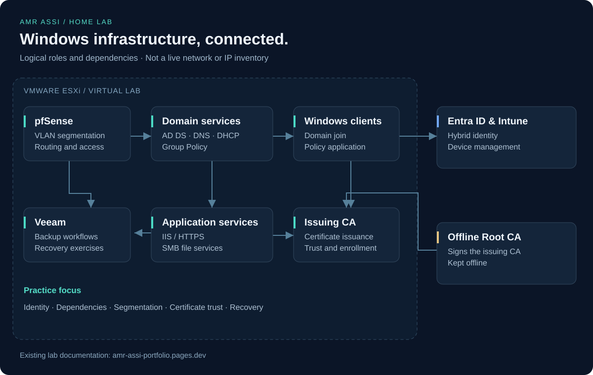
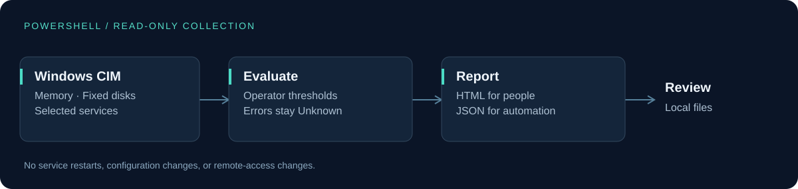

# Systems & Infrastructure Portfolio

Practical Windows infrastructure, operations, troubleshooting, and PowerShell work by **Amr Assi**.

[Live portfolio](https://amr-assi-portfolio.pages.dev/) · [GitHub profile](https://github.com/AmrAssi) · [LinkedIn](https://www.linkedin.com/in/amr-assi-b13451232/)

## Explore the work

| Project | Focus | Start here |
| --- | --- | --- |
| **Enterprise Home Lab** | Windows infrastructure, identity, network segmentation, PKI, and recovery. | [Architecture & documentation](labs/enterprise-home-lab/) |
| **Administration Scripts** | RDS sessions, AD onboarding, and profile-disk investigation. | [Scripts & Hebrew explanations](tools/admin-scripts/) |
| **Server Health Report** | PowerShell, CIM, error handling, thresholds, and readable reports. | [Source & usage](tools/server-health-report/) |
| **Recovery case study** | Recovering a business application file with Zerto after endpoint rollback was insufficient. | [Incident walkthrough](case-studies/file-recovery-after-endpoint-quarantine.md) |

## Enterprise Home Lab



More than **300 hours** building and troubleshooting an ESXi lab spanning AD DS, DNS, DHCP, Group Policy, pfSense, two-tier PKI, IIS, Entra ID, Intune, and Veeam.

[Read the lab documentation](labs/enterprise-home-lab/) · [Existing evidence gallery](https://amr-assi-portfolio.pages.dev/#gallery)

## PowerShell project



The [Windows Server Health Report](tools/server-health-report/) collects memory, disk, and selected service checks. Collection failures remain **Unknown** instead of appearing healthy. Each run produces local HTML and JSON reports.

**Verified:** parser, behavioral, and real local Windows collection tests passed in Windows PowerShell 5.1 and PowerShell 7. [Validation details](tools/server-health-report/docs/validation.md)

## Operations and recovery

- [Real incident: file recovery after endpoint quarantine](case-studies/file-recovery-after-endpoint-quarantine.md)
- [Group Policy investigation](labs/enterprise-home-lab/docs/troubleshooting/gpo-not-applied.md)
- [DNS investigation](labs/enterprise-home-lab/docs/troubleshooting/dns-resolution.md)
- [File-recovery validation](labs/enterprise-home-lab/docs/troubleshooting/file-recovery.md)

The incident is an anonymized account of professional work. The three lab runbooks are prepared exercises with acceptance criteria; their execution results are not yet recorded.

## Professional context

I support multi-client Windows and Microsoft 365 environments, including Active Directory, VMware vCenter/ESXi operations, file recovery, endpoint security, and Zabbix monitoring.

During a previous Windows 11 deployment project, I personally prepared **300+ computers for 150 branches**, including imaging, domain join, applications, IP/DNS settings, printers, peripherals, and functional checks.

## Repository map

```text
index.html                       Existing portfolio website
assets/diagrams/                 Original infrastructure illustrations
labs/enterprise-home-lab/         Environment, evidence, and runbooks
tools/server-health-report/      Health reporting and validation
tools/admin-scripts/             RDS and Active Directory operations
case-studies/                    Anonymized professional experience
.github/workflows/               Automated Windows checks
```

## Related learning resources

[SysAdmin Learning Lab](https://github.com/AmrAssi/system) · [SysAdmin Prep](https://github.com/AmrAssi/sysadmin-prep)
