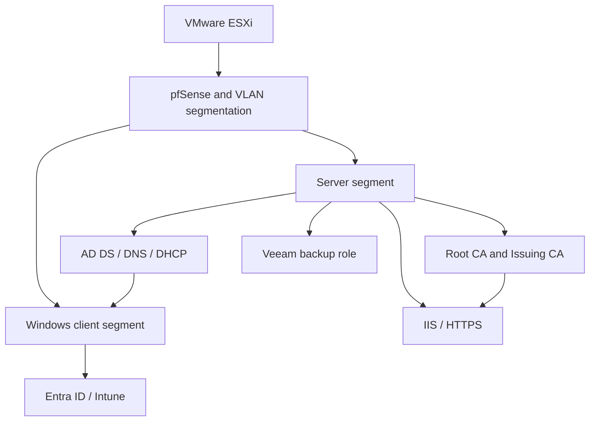

# Enterprise Home Lab
**Amr Assi | Systems and Infrastructure**

An enterprise-style lab built on VMware ESXi to practice Windows infrastructure, network segmentation, identity management, certificate services, and recovery.

[Portfolio and documentation](https://amr-assi-portfolio.pages.dev/#projects) · [Evidence gallery](https://amr-assi-portfolio.pages.dev/#gallery)

## Scope of this documentation
The environment summary below reflects Amr's described lab and its existing portfolio documentation. The troubleshooting exercises in this repository are procedures to execute and record; they are not claims that new tests have already passed.

## Environment
| Area | Components | Operational purpose |
| --- | --- | --- |
| Virtualization | VMware ESXi | Host the lab's server and client roles. |
| Identity | Active Directory, DNS, DHCP, Group Policy | Centralize identity, addressing, name resolution, and policy. |
| Certificates | Root CA, Issuing CA, auto-enrollment | Practice certificate issuance and trust. |
| Networking | pfSense, VLANs, inter-VLAN routing | Separate network segments and control traffic. |
| Web services | IIS and HTTPS | Publish a service using the lab's certificate infrastructure. |
| Hybrid management | Entra ID and Intune | Practice identity integration and device enrollment. |
| Recovery | Veeam Backup & Replication | Practice backup and recovery validation. |

## Logical architecture
This diagram summarizes the documented roles and dependencies. It is not a port-level or current IP-address inventory.

## Reading path
1. [Evidence and validation](docs/evidence-and-validation.md)
2. [GPO troubleshooting exercise](docs/troubleshooting/gpo-not-applied.md)
3. [DNS troubleshooting exercise](docs/troubleshooting/dns-resolution.md)
4. [File recovery exercise](docs/troubleshooting/file-recovery.md)

## Engineering questions
- Which services depend on DNS and domain authentication?
- Which clients and servers require access across each network boundary?
- How is certificate trust established and validated?
- How is a restored file checked against the expected version?

The repository separates configuration evidence from test outcomes so that each result can be discussed and reproduced during a technical interview.
